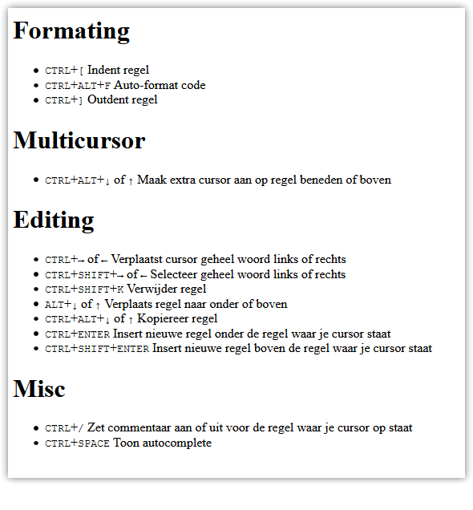

# DEVOPS-2 -TAAK-01

- [DEVOPS-2 -TAAK-01](#devops-2--taak-01)
  - [Sneller werken in VS Code](#sneller-werken-in-vs-code)
  - [Uitleg](#uitleg)
  - [Keyboard shortcuts](#keyboard-shortcuts)
    - [Formating](#formating)
    - [Multicursor](#multicursor)
    - [Editing](#editing)
    - [Misc](#misc)
  - [Leerdoelen](#leerdoelen)
  - [Opdracht](#opdracht)
  - [Eindresultaat](#eindresultaat)
  - [Bronnen](#bronnen)

## Sneller werken in VS Code

## Uitleg

## Keyboard shortcuts

VS code heeft een aantal handig keyboard shortcuts om snel code te manipuleren, zie [Bronnen](##Bronnen). Een aantal daarvan worden hier behandeld.

* <kbd>CTRL</kbd>+<kbd>K</kbd>, <kbd>CTRL</kbd>+<kbd>S</kbd> Toon alle keyboardshortcuts (inclusief filter op functie)

### Formating

* <kbd>CTRL</kbd>+<kbd>[</kbd> Indent regel
* <kbd>CTRL</kbd>+<kbd>]</kbd> Outdent regel
* <kbd>CTRL</kbd>+<kbd>ALT</kbd>+<kbd>F</kbd> Auto-format code

### Multicursor

* <kbd>CTRL</kbd>+<kbd>ALT</kbd>+<kbd>↓</kbd> of <kbd>↑</kbd> Maak extra cursor aan op regel beneden of boven
                                                                                
### Editing

* <kbd>CTRL</kbd>+<kbd>→</kbd> of <kbd>←</kbd>  Verplaatst cursor geheel woord links of rechts
* <kbd>CTRL</kbd>+<kbd>SHIFT</kbd>+<kbd>→</kbd> of <kbd>←</kbd>  Selecteer geheel woord links of rechts
* <kbd>CTRL</kbd>+<kbd>SHIFT</kbd>+<kbd>K</kbd> Verwijder regel
* <kbd>ALT</kbd>+<kbd>↓</kbd> of <kbd>↑</kbd> Verplaats regel naar onder of boven
* <kbd>CTRL</kbd>+<kbd>ALT</kbd>+<kbd>↓</kbd> of <kbd>↑</kbd> Kopiereer regel 
* <kbd>CTRL</kbd>+<kbd>ENTER</kbd> Insert nieuwe regel onder de regel waar je cursor staat
* <kbd>CTRL</kbd>+<kbd>SHIFT</kbd>+<kbd>ENTER</kbd> Insert nieuwe regel boven de regel waar je cursor staat

### Misc
* <kbd>CTRL</kbd>+<kbd>/</kbd> Zet commentaar aan of uit voor de regel waar je cursor op staat
* <kbd>CTRL</kbd>+<kbd>SPACE</kbd> Toon autocomplete

## Leerdoelen

1. Ik kan sneller werken met keyboard shortcuts in VS Code

## Opdracht

1. Bekijk de bovenstaande lijst met keyboard shortcuts. Kijk of het lukt om `index.html` alleen met keyboard shortcuts te veranderen. Zorg er ook voor dat de code in VS code netjes is uitgelijnd en goed leesbaar is natuurlijk.

## Eindresultaat

Onderstaande in je browser

 ## Bronnen

* [Overzicht VS Code keyboard shortcuts (PDF)](https://code.visualstudio.com/shortcuts/keyboard-shortcuts-windows.pdf)
* [Essential Keyboard Shortcuts for Visual Studio Code](https://www.makeuseof.com/tag/visual-studio-code-keyboard-shortcuts-cheat-sheet/)
