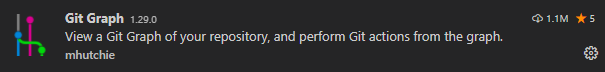

# DEVOPS-2 - 01 - VS Code - Taak 03

## Git Extensies

- [DEVOPS-2 - 01 - VS Code - Taak 03](#devops-2---01---vs-code---taak-03)
  - [Git Extensies](#git-extensies)
  - [Uitleg](#uitleg)
  - [Leerdoelen](#leerdoelen)
  - [Opdracht](#opdracht)
  - [Eindresultaat](#eindresultaat)
  - [Bronnen](#bronnen)

## Uitleg

VS Code geeft al standaard heel veel mogelijkheden om om te gaan met versiebeheer en je hoeft bijna niks meer te doen in de terminal. De onderstaande extensie voegt daar nog wat aan toe.

We gaan deze extensie volop gebruiken in het tweede deel van deze module.

* [ Git Graph by mhutchie](https://marketplace.visualstudio.com/items?itemName=mhutchie.git-graph)  
    > Voegt een visuele interface toe aan VS Code waarin je de meeste acties die je doet in een repository kunt uitvoeren.

## Leerdoelen

1. Ik heb de Git Graph extensie geinstalleerd

## Opdracht

1.  Installeer de Git Graph-extensie in VS Code
2.  Open de Git Graph-extensie in VS Code en bekijk de interface alvast. Er zijn meerdere manieren om de Git Graph-extensie te openen:
    1. Gebruik de  knop links onder in het VS Code-venster.
    2. Gebruik de  knop in het Source Control panel.
    3. Of open het command-palette (<kbd>CTRL</kbd>+<kbd>SHIFT</kbd>+<kbd>P</kbd>) en begin te typen: `gitgr`.. tot de optie **Git Graph: View Git Graph (Git log)** bovenaan staat en selecteer deze optie. 

## Eindresultaat

Bij Extensions > Installed staat Git Graph geïnstalleerd.

## Bronnen

* [ Git Graph VS Code extension by mhutchie](https://marketplace.visualstudio.com/items?itemName=mhutchie.git-graph)

