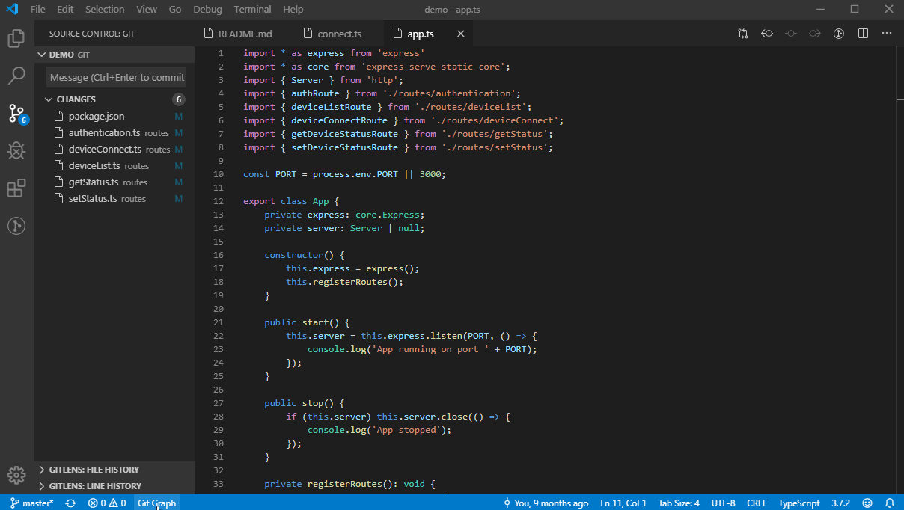

# DEVOPS-2 - 01 - VS Code - Taak 03

## Git Extensies

## Uitleg

VS code 

* [ Gitgraph by mhutchie](https://marketplace.visualstudio.com/items?itemName=mhutchie.git-graph)  
    > Voegt een visuele interface toe aan VS Code waarin je de meeste acties die je doet in een repository kunt uitvoeren.

## Leerdoelen

1. Ik heb de Git Graph extensie geinstalleerd

## Opdracht

1.  Installeer de Gitgraph extensie in VS Code
2.  Open de Git Graph extensie in VS code en bekijk de interface
    1.  Gebruik het Command Palette

## Eindresultaat

## Bronnen
