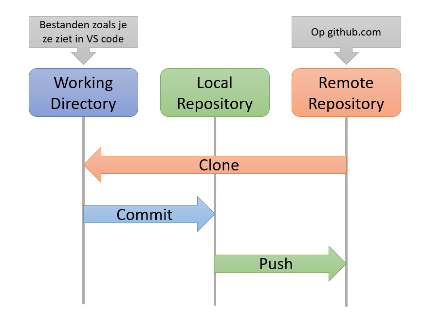

# DEVOPS-2 - 02 - Versiebeheer - Taak 00

## Git tot nu toe

- [DEVOPS-2 - 02 - Versiebeheer - Taak 00](#devops-2---02---versiebeheer---taak-00)
  - [Git tot nu toe](#git-tot-nu-toe)
  - [Uitleg](#uitleg)
    - [Hoe we tot nu werkten](#hoe-we-tot-nu-werkten)
    - [De al bekende termen](#de-al-bekende-termen)
    - [Verder met versiebeheer](#verder-met-versiebeheer)
  - [Leerdoelen](#leerdoelen)
  - [Opdracht](#opdracht)
  - [Eindresultaat](#eindresultaat)
  - [Bronnen](#bronnen)

## Uitleg

### Hoe we tot nu werkten

Tot nu toe heb je bij het maken van de modules in Eagle de onderstaande workflow tussen Git en Github gebruikt:

### De al bekende termen

Je bent inmiddels bekende geraakt met de onderstaande dingen die je met Git en Github doet:
* **Clonen**: Het kopieren van een een _remote repository_ naar je laptop (lokaal)
* **Committen**: Het toevoegen van een snapshot van je code (een commit) aan je _local repository_.
* **Pushen**: Het kopieren van de commits van je _local repository_ naar een _remote repository_.

Een paar termen die misschien nog niet helemaal bekend zijn nog eens toegelicht:
* **Working Directory**: Dit is de versie van de bestanden zoals je die ziet in VS code.
  > Als we het hebben over de Working Directory dan hebben we het over de mappen en bestanden die op dat moment in VS code te zien en te editen zijn. Je kunt de bestanden in je Working Directory veranderen naar een eerdere versie zoals die in een eerder gemaakte commit zijn opgeslagen.

* **Local Repository**: Dit is de repository zoals die lokaal bij jouw op je laptop staat. 
  > Misschien heb je al gezien dat elke module een verborgen map bevat genaamd `.git`. Dit is de map die Git op de achtergrond gebruikt om alle veranderingen die je maakt en commit bij te houden. Git beheert deze map voor je en je hoeft hier dus zelf nooit handmatig dingen in te veranderen. 

* **Remote Repository**: Dit is de repository zoals die op Github staat.
  > Als je lokaal een aantal commits hebt gemaakt maar deze nog niet gepushed hebt dan is de staat van je repository zoals die op github staat anders dan die je lokaal hebt staan. De remote repository loopt een aantal commits achter. Op het moment dat je pushed naar Github kopieer je eigenlijk je lokale repository naar de remote repository zodat deze weer synchroon lopen met elkaar.

### Verder met versiebeheer

In dit onderdeel van de module gaan we verder in op hoe je samenwerkt met Git en Github. 

:rocket: **TLDR**; Het lijkt misschien lang geleden maar er was een tijd dat je geen idee had wat een commit was en wat er gebeurde als  je je code pushte naar Github. Dat je dit inmiddels heb leren doen is al hardstikke goed! Vroegere studenten kwamen vaak pas in hun stage in aanraking met versiebeheer. 

De overige taken in dit onderdeel zullen veel van je vragen. Je zal hier en daar voorzichtig oefenen met de uitgelegde concepten maar het zal even duren voor je net zo vertrouwd bent met de nieuwe concepten als met clone, commit en push. Dat geeft helemaal niks. Zoals altijd, veel doen en fouten maken is manier om te leren. 

## Leerdoelen

1. Ik kan in één zin uitleggen wat er bedoeld wordt met de Working Directory
2. Ik kan in één zin uitleggen wat er bedoeld wordt met een Local Repository
3. Ik kan in één zin uitleggen wat er bedoeld wordt met een Remote Repository
4. Ik kan in één zin uitleggen wat er bedoeld wordt met clonen, committen en pushen.

## Opdracht

1. Lees de uitleg en zorg ervoor dat je een beeld hebt bij de verschillende onderdelen in bovenstaande workflow (zoals je die al de hele tijd toepast.)  

## Eindresultaat

Je kunt uitleggen wat er bedoeld wordt met de clonen, committen en pushen en gebruikt daarbij de termen working directory, local repository en remote repository. 

## Bronnen

* [Aan de slag - Over versiebeheer](https://git-scm.com/book/nl/v2/Aan-de-slag-Over-versiebeheer)
* [Aan de slag - Wat is Git?](https://git-scm.com/book/nl/v2/Aan-de-slag-Wat-is-Git%3F)