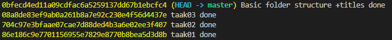
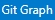
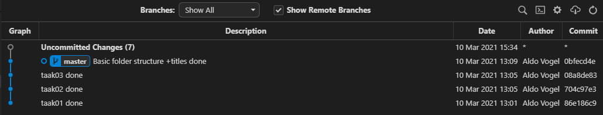

# DEVOPS-2 - 02 - Versiebeheer - Taak 01

## Git log

## Uitleg

Door het commando `git log` in je terminal uit te voeren krijg je een overzicht van alle commits in een repository. 

```cmd
git log --pretty=oneline
```

> Gebruik <kbd>ENTER</kbd> om de volgende regel te tonen in de terminal.  
> Gebruik <kbd>Q</kbd> om af te sluiten en weer nieuwe commandos te kunnen invoeren in je terminal


### Commit Hash



Bovenstaande screenshot laat 4 commits zien, een op elke regel. 
* De gele reeks letters en getallen noem je de **commit hash**. 
* Elke commit heeft een commit hash. Deze is altijd uniek. Git gebruikt de commit hash om onderscheid te kunnen maken tussen de verschillende commits.
* In grijze tekst zie je de commit messages van elke commit. 
* De tekst `(HEAD -> master)` geeft aan dat dat de commit is die op dit moment te zien is in je editor. Daarover later meer.

### Gitgraph

Door gebruik te maken van de **Gitgraph** extensie kunnen we ook een overzicht maken van de commits van een repository. Open hiervoor het command-palette (<kbd>CTRL</kbd>+<kbd>SHIFT</kbd>+<kbd>P</kbd>) en begin te typen: `gitgr`.. tot de optie **Gitgraph: View Git Graph (Git log)** bovenaan staat en selecteer deze optie. Of gebruik de  knop links onder in het VS Code venster.

Er opent zich een nieuwe tab in je editor genaamt `Gitgraph`, zie onderstaande screenshot voor een voorbeeld.



> Let op de 4de kolom. Deze geeft de eerst 8 characters weer van de commit hash. Als je git via de command line iets met een bepaalde commit wilt laten doen dan volstaat het om niet de gehele hash in je commando te gebruiken maar alleen de eerste acht karakters. 

Later gaan we de **Gitgraph** interface gebruiken om gemaakte commits _uit te checken_ voor kijk even naar wat voor informatie je te zien krijgt.

## Leerdoelen

1. Ik weet dat elke commit een commit hash heeft en dat deze uniek is
2. Ik kan de commit hash vinden van een commit

## Opdracht

1.  Toon alle commits in de console via `git log`
2.  Toon de Commits via de Gitgraph extensie

## Eindresultaat

#### Voorbeeld output in de console 


#### Voorbeeld output van Git Graph


## Bronnen
* [Git Basics - De commit geschiedenis bekijken](https://git-scm.com/book/nl/v2/Git-Basics-De-commit-geschiedenis-bekijken)