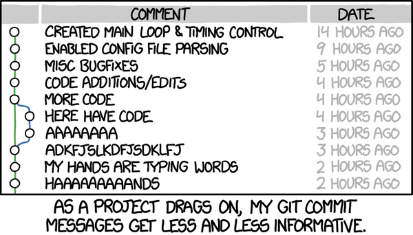
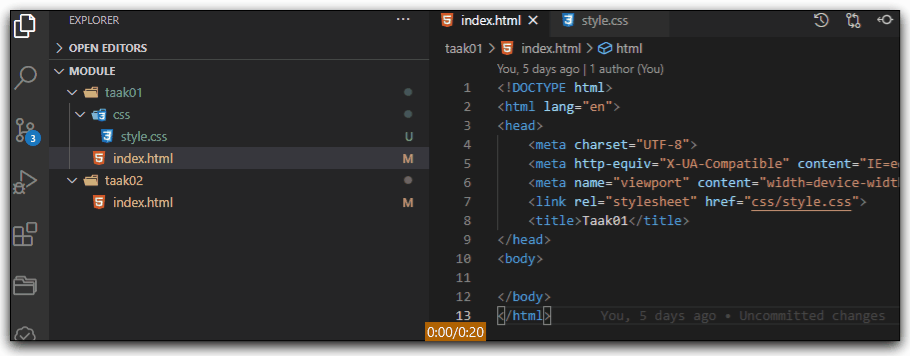

# DEVOPS-2 - 02 - Versiebeheer - Taak 02

## Stage & Commit

- [DEVOPS-2 - 02 - Versiebeheer - Taak 02](#devops-2---02---versiebeheer---taak-02)
  - [Stage & Commit](#stage--commit)
  - [Uitleg](#uitleg)
    - [Goede commitmessages](#goede-commit-messages)
    - [Stagen van bestanden](#stagen-van-bestanden)
  - [Leerdoelen](#leerdoelen)
  - [Opdracht](#opdracht)
  - [Eindresultaat](#eindresultaat)
  - [Bronnen](#bronnen)

## Uitleg

### Goede commit messages 

Het voordeel van een versiebeheerssysteem zoals git is dat je kan zien wie wanneer welke verandering heeft gemaakt.

Omdat je straks gaat samenwerken in een gedeelde repository is het belangrijk dat je in de commitmessages die je schrijft, als je een commit maakt, goed uitlegt wat er in die commit veranderd is in de code.

De commitmessages van een repository vertellen het verhaal van het project waar je aan werkt.

Jouw teamgenoten en jouw toekomstige ik moeten kunnen begrijpen hoe het project veranderd is in de tijd om goed met de code te kunnen werken.

Een goed beschrijvende commitmessage is daarvoor essentieel.

**Een goede commitmessage:**
  >1. is kort & bondig
  >2. is informatief
  >3. Maakt duidelijk wat een commit doet als een teamgenoot deze _uitcheckt_. (zie taak03)

### Stagen van bestanden

Tot nu toe heb je waarschijnlijk meerdere taken afgerond en vervolgens in één grote commit gestopt. 

In het algemeen is het _best practice _om de inhoud van de commit te beperken tot bestanden die bij een bepaalde _feature_ horen of in het geval van het lesmateriaal tot een enkele taak of eindopdracht. 

Het selecteren van bestanden om in een commit te plaatsen doe je door de bestanden te _stagen_. Je hebt het misschien al eens gedaan; als je kijkt bij de het **Source Control**-paneel in VS Code staat naast elk gewijzigd bestand een plusje.

In bovenstaande gif zie je een voorbeeld van het toevoegen van twee bestanden die bij een taak horen en het commiten daarvan met een _redelijk_ duidelijke commit message.

:zap: **LETOP**: Als je straks samenwerkt, hoef je geen informatie toe te voegen die al duidelijk is vanuit de extra informatie die Git voor je bijhoudt. Dus commitmessages zoals "Piet code veranderd 20 maart" zijn onnodig want deze bevat verwijzigingen naar de auteur en de datum, twee dingen die Git al bij elke commit voor je bijhoudt. Een betere commitmessage zou zijn: "bugfix in userregistratie".

## Leerdoelen

1. Ik kan gewijzigde bestanden selecteren en deze samen in een commit plaatsen met een goed beschrijvende commit message. 

## Opdracht

1. Bij deze taak hoort een opdracht die je bij de rest van het lesmateriaal en de challenges moet uitvoeren: plaats vanaf nu gewijzigde bestanden die bij elkaar horen samen in een commit en schrijf goed beschrijvende commit messages. 
> Dit is niet alleen belangrijk voor je eigen werk maar laat ook zien aan toekomstige stagebegeleiders en/of opdrachtgevers dat je gestructureerd kan werken. Dat je binnen een team rekening houdt met de overige teamleden en dus goed bent in samenwerken, iets dat in voor een toekomstige werkgever vaak belangrijker is dan het bezitten van veel technische kennis of ervaring.

## Eindresultaat

Bij volgende commits die je in de verschillende modules doet voeg je alleen de bestanden toe die bij een bepaalde taak horen.

## Bronnen

* [Git Tools - Interactief stagen](https://git-scm.com/book/nl/v2/Git-Tools-Interactief-stagen)