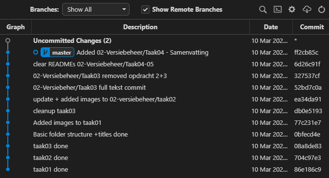

# DEVOPS-2 - 02 - Versiebeheer - Taak 04

## Samenvatting

## Uitleg

Ok, dus we hebben nu gezien dat je in de tijdlijn van commits elke commit terug kan halen via `git checkout`. 

Even een korte samenvatting van de nieuwe termen die we in voorgaande taken zijn tegengekomen, zie onderstaande output van `git log --pretty=oneline` in de terminal:

* **Commit Hash**: Unieke reeks cijfers en letters die hoort bij een commit.
* **Commit Message**: In het grijs. Geeft kort en bondig weer wat er in code die bij die commit hoort is veranderd.
* **HEAD**: In het blauw. De **HEAD** geeft aan welke commit op dit moment is uitgecheckt.

> :zap: Zo'n lijst van commits wordt ook wel een _boom_ (tree) genoemd. De HEAD wijst standaard naar de laatste commit, oftewel de top van de boom. Als je een eerder gemaakte commit uitcheckt dan verplaatst de HEAD zich naar die commit en bevindt Git zich in een _DETACHED HEAD state_. In de terminal krijg je een waarschuwing en bij Gitgraph moet je expliciet toestemming geven daarvoor. 

## Leerdoelen

1. Ik kan

## Opdracht

1.  

## Eindresultaat

## Bronnen