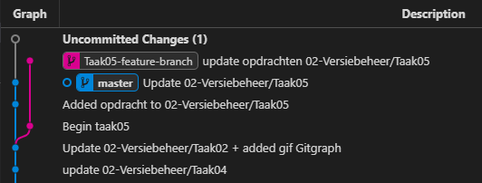
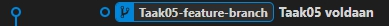

# DEVOPS-2 - 02 - Versiebeheer - Taak 05

## Branches

- [DEVOPS-2 - 02 - Versiebeheer - Taak 05](#devops-2---02---versiebeheer---taak-05)
  - [Branches](#branches)
  - [Uitleg](#uitleg)
    - [Branches](#branches-1)
      - [Git Graph](#git-graph)
      - [Drie manieren om checkout branch te doen in VS Code](#drie-manieren-om-checkout-branch-te-doen-in-vs-code)
  - [Leerdoelen](#leerdoelen)
  - [Opdracht](#opdracht)
  - [Eindresultaat](#eindresultaat)
  - [Bronnen](#bronnen)

## Uitleg

### Branches

Zoals eerder genoemd vormen de commits in repository een _tree_ (boom). Tot nu toe was dit een heel simpele boom zonder aftakkingen. Alle commits bevonden zich op de zogenaamde **master** _branch_. 

> :zap: Sinds 1 oktober 2020 kun je ook de naam **MAIN** tegenkomen op Github als er wordt gesproken over de centrale branch in een repository. Dit is gedaan vanwege de negatieve connotatie die het woord MASTER in relatie tot slavernij met zich meebrengt.

Je kunt zelf branches aanmaken. Dit doe je om bijvoorbeeld aan één specifiek onderdeel of _feature_ van een project te werken. 

Als je dan klaar bent met die feature dan kun je die branch weer samenvoegen met de rest van je code. Dit samenvoegen noem je **mergen**.

Op deze manier kunnen verschillende developers elk in een eigen branch tegelijk werken aan code en deze committen zonder elkaar in de weg te zitten.
#### Git Graph

Zie onderstaande output van Git Graph waar een nieuwe branch te zien is genaamd `Taak05-feature-branch`. 

> **toelichting**  
> * Elk ingevuld bolletje is een commit. 
> * De kleur geeft aan bij welke branch deze commit hoort 
> * er zijn twee branches te zien: `Master` en `Taak05-feature-branch`. 
> * Het gekleurde _lege_ bolletje geeft aan op welke branch en commit je zit.

#### Drie manieren om checkout branch te doen in VS Code
1. Gebruik de VS Code interface:
   > Links onder in de VS Code interface wordt getoond op welke branch je op dit moment zit.  Klik op die knop en kies een branch in het dropdownmenu boven aan en in het midden van de interface om een branch uit te checken.
2. Gebruik de Git Graph interface:
    > Rechtermuis knop op een branch toont opties, kies voor `Checkout Branch`.
3. Gebruik de Terminal:
    > Voer het commando `git checkout <branchnaam>`

## Leerdoelen

1. Ik weet wat een branch is binnen het Git-ecosysteem en waarvoor deze worden gebruikt.
2. Ik kan verwisselen van de branch door gebruik te maken van de Terminal / Git Graph of de VS Code interface. 

## Opdracht

1. Doe een checkout van de branch **Taak05-feature-branch** en ga naar opdracht 2 van deze taak.
## Eindresultaat

Links onder staat in de VS Code-interface de naam van de uitgecheckte branch, in dit geval moet het **Taak05-feature-branch** zijn. Er is een nieuwe commit met als commit message "Taak05 voldaan" toegevoegd aan de **Taak05-feature-branch**.

## Bronnen
* [Branchen in Git - Branches in vogelvlucht](https://git-scm.com/book/nl/v2/Branchen-in-Git-Branches-in-vogelvlucht)