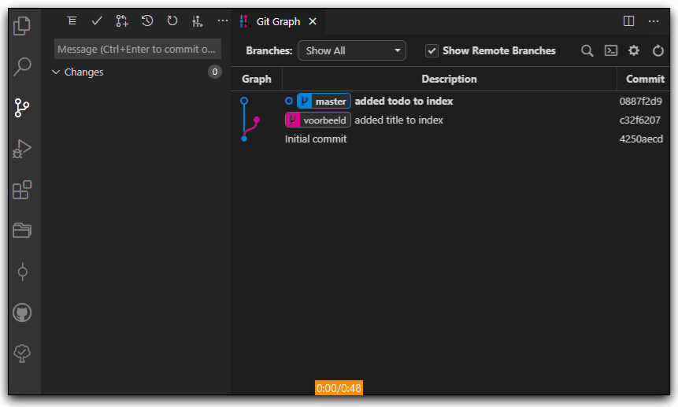

# DEVOPS-2 - 02 - Versiebeheer - Taak 06

## Mergen

## Uitleg

Meestal kan Git het samenvoegen van twee branches of commits automatisch voor je doen zoals dat gebeurde bij de vorige taak.

Maar soms is er een conflict tussen twee versies van een bestand. Dit noem je een merge conflict en dit betekent dat jij moet kiezen welke versie van het bestand de juiste is.  

:rocket: def. **merge conflict**: dit gebeurt als er twee versies zijn van een bestand en git niet automatisch kan bepalen welke versie klopt.

Gelukkig geeft VS Code je een gemakkelijke interface om merge conflicts op te lossen.

## Leerdoelen

1. Ik kan een branch mergen en merge conflicts oplossen

## Opdracht

1.  Merge de branch **Taak07-merge-conflict** met de master branch en los het merge conflict op.
> Zoals bij voorgaande taken staat er bij de **Taak07-merge-conflict** branch meer informatie in de README.md. In tegenstelling tot de vorige taken is er echter nu een verandering te vinden op een bepaalde regel en weet git niet hoe dit op te lossen zonder jouw hulp! 

## Eindresultaat

Je moet de **Taak07-merge-conflict** branch nog mergen met de **master** branch...

## Bronnen