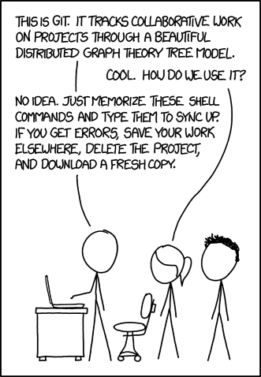
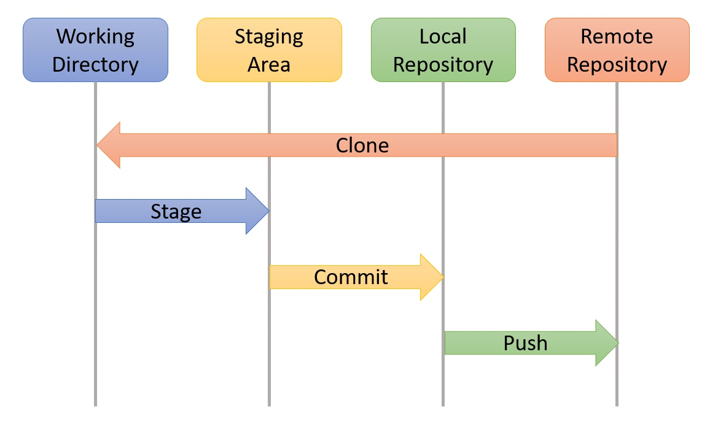
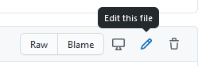
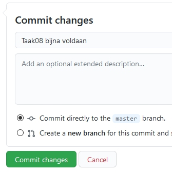
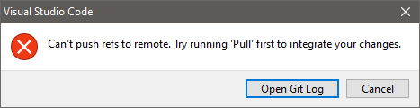

# DEVOPS-2 - 02 - Versiebeheer - Taak 07

## Samenwerken

## Uitleg

Zo, we hebben veel concepten aangestipt in de vorige taken:
* Git log (mbv Gitgrap of de terminal)
* Stagen van bestanden voor een commit
* Een commit uitchecken
* Branches en branches uitchecken
* Mergen van branches
* Merge conflicten oplossen

Als dit je allemaal nog niet helder is dan geeft dat niks. Git staat erom bekend dat het een tijdje duurt voor je begrijpt wat er op de achtergrond ongeveer gebeurt. De enige manier om over die hobbel heen te komen is het te gebruiken en veel fouten te maken. En als je er echt niet uitkomt dan kun je altijd een nieuwe clone maken van het lesmateriaal en het opnieuw proberen.

### Samenwerken

Uiteindelijk is straks de bedoeling dat je gaat samenwerken aan een challenge in een gedeelde repository. Dit kun je doen door een student waarmee je samenwerkt rechten te geven in de repository op Github. Dit doe je dus op https://www.github.com bij de settings van de repository en te kiezen voor `invite a collaborator`. Dit zal in de challenge nogeens worden uitgelegd.

Maar hoe werk je dan echt samen?

Tot nu toe hebben we aan het lesmateriaal van een module gewerkt door deze eerst te clonen en daarna veranderingen te comitten en pushen naar github. Misschien heb je hier en daar eerst bestanden gestaged voor je een commit deed maar de basic workflow zag er uit als onderstaand plaatje.

Toelichting:
* Working directory: dit zijn de bestanden die je ziet in VS code en kunt aanpassen. 
* Staging Area: dit zijn bestanden die veranderd zijn en je in je volgende commit wilt toevoegen
* Local Repository: Dit is de repository die op jouw computer lokaal staat. Hierin staan alle commits die je hebt gedaan.
* Remote Repository: Dit is de repository zoals die op github staat.

Wanneer je samenwerkt in een repository op github dan heb je allebei een eigen local repository gecloned naar je laptop of computer. Je volgt dan de stappen die je al kent: stage, commit & push om gemaakte code te kopieren naar de gedeelde repository op github. Maar wat als de developer waarmee je samenwerkt al code heeft gepushed? 

Jouw lokale versie loopt dan achter op de remote versie.

Als je dan probeert jouw laatste commit(s) te pushen naar Github krijg je een melding dat dit niet kan en je eerst een **Pull** moet doen. Zo'n **Pull** uitvoeren betekent dat je de laatste wijzigingen in de remote repository ophaalt en deze samenvoegt met jou lokale repository. 

Het zal vaak voorkomen dat Git de veranderingen automatisch merged voor je.

Maar het kan ook zijn dat je eerst merge conflicts moet oplossen en committen voor je jou eigen commits kan pushen naar Github. Vandaar dat als je weet dat je allebei veel dezelfde bestanden gaat aanpassen dat het handig is om een branch te maken en daarop te werken.

## Leerdoelen

1. Ik kan samenwerken in een gedeelde repository.

## Opdracht

1.  Om te simuleren hoe het is om eerst een pull te moeten doen voor je nieuwe commits kan pushen gaan we via Github wijzigen maken in een bestand op de remote repository. Login op Github, ga naar deze module repository en navigeer naar dit README.md bestand via web interface. 

    

    Kies dan voor de potlood icon om in de webinterface dit bestand te bewerken. Vervang je ********** hieronder bij :one: met je eigen naam en scroll naar beneden om een nieuwe commit te maken in de remote repository op Github. Vul uiteraard een goed beschrijven commit message in.

    

    :one: Student naam: ************

2. De remote repository op Github loopt nu één commit voor op de local repository die je open hebt in VS Code. Vul nu in VS Code de regel hieronder (alleen onderstaande regel bij :two:, bovenstaande laten staan zoals die is) in met je eigen naam, stage dit bestand en commit dit bestand in VS Code.
   
    :two: Student naam: ************

3. Probeer de wijzigingen die je lokaal gecommit hebt te pushen naar Github. Als het goed is krijg je een foutmelding dat je eerst een pull moet doen. 
   
   
   
   Kies de optie Pull uit het extra opties menu (···) in je Source Control paneel. 
   > :zap: **LETOP**: je krijgt nu een merge conflict waarbij je gegevens van beiden commits wilt behouden. Kies de juiste optie bij het mergen zodat bij :one: en bij :two: je eigen naam nog staat ingevuld. VS Code vult zelf een duidelijke commit message voor je in.

4. Probeer weer te pushen en check online op Github bij deze module repository of de commits goed zijn gepushed.

## Eindresultaat

Bij :one: en bij :two: staat je naam ingevuld.

## Bronnen