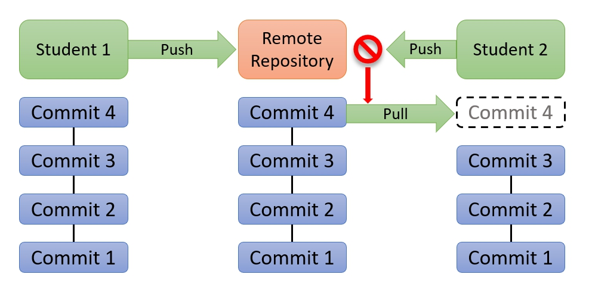

# DEVOPS-2 - 02 - Versiebeheer - Taak 07

## Samenwerken

- [DEVOPS-2 - 02 - Versiebeheer - Taak 07](#devops-2---02---versiebeheer---taak-07)
  - [Samenwerken](#samenwerken)
  - [Uitleg](#uitleg)
    - [Samenwerken](#samenwerken-1)
    - [Maar hoe werk je dan echt samen?](#maar-hoe-werk-je-dan-echt-samen)
  - [Leerdoelen](#leerdoelen)
  - [Opdracht](#opdracht)
  - [Eindresultaat](#eindresultaat)
  - [Bronnen](#bronnen)

## Uitleg

### Samenwerken

### Maar hoe werk je dan echt samen?

Tot nu toe hebben we aan het lesmateriaal van een module gewerkt door deze eerst te clonen en daarna veranderingen te committen en te pushen naar Github. Misschien heb je hier en daar eerst bestanden gestaged voor je een commit deed maar de basic workflow zag er uit als onderstaand plaatje.

Wanneer je samenwerkt in een repository op Github dan heb je allebei een eigen local repository gecloned naar je laptop of computer. Je volgt dan de stappen die je al kent: stage, commit & push om gemaakte code te kopiëren naar de gedeelde repository op Github. Maar wat als de developer waarmee je samenwerkt al code heeft gepusht? 

Jouw lokale versie loopt dan achter op de remoteversie.

Als je dan probeert jouw laatste commit(s) te pushen naar Github krijg je een melding dat dit niet kan en je eerst een **Pull** moet doen. Zo'n **Pull** uitvoeren betekent dat je de laatste wijzigingen in de remote repository ophaalt en deze samenvoegt met jou lokale repository. 

Zie onderstaand plaatje waarin Student 1 een commit heeft gemaakt (Commit 4) en deze naar Github heeft gepusht waardoor student 2 eerst een pull (en merge) moet doen om zijn werkt te kunnen committen en pushen.

Het zal vaak voorkomen dat Git de veranderingen automatisch mergt voor je.

Maar het kan ook zijn dat je eerst mergeconflicts moet oplossen en committen voor je jouw eigen commits kan pushen naar Github. Vandaar dat, als je weet dat je allebei veel dezelfde bestanden gaat aanpassen, dat het handig is om een branch te maken en daarop te werken.

## Leerdoelen

1. Ik weet dat ik soms eerst een pull moet doen om de veranderingen op de remote repository samen te voegen met mijn lokale repository.
2. Ik kan een mergeconflict oplossen 

## Opdracht

1.  Om te simuleren hoe het is om eerst een pull te moeten doen voor je nieuwe commits kan pushen, gaan we via Github wijzigen maken in een bestand op de remote repository. Login op Github, ga naar deze module repository en navigeer naar dit README.md bestand via web interface. 

    

    Kies dan voor de potlood icon om in de webinterface dit bestand te bewerken. Vervang je ********** hieronder bij :one: met je eigen naam en scroll naar beneden om een nieuwe commit te maken in de remote repository op **Github**. Vul uiteraard een goed beschrijven commitmessage in.

    

    :one: Student naam: ************

2. De remote repository op Github loopt nu één commit voor op de local repository die je open hebt in VS Code. Vul nu in VS Code de regel hieronder (alleen onderstaande regel bij :two:, bovenstaande laten staan zoals die is) in met je eigen naam, stage dit bestand en commit dit bestand in **VS Code**.
   
    :two: Student naam: ************

3. Probeer de wijzigingen die je lokaal gecommit hebt te pushen naar Github. Als het goed is krijg je een foutmelding dat je eerst een pull moet doen. 
   
   
   
   Kies de optie Pull uit het extra opties menu (···) in je Source Control paneel. 
   > :zap: **LETOP**: je kan nu een mergeconflict krijgen waarbij je gegevens van beiden commits wilt behouden. Kies de juiste optie bij het mergen zodat bij :one: en bij :two: je eigen naam nog staat ingevuld. VS Code vult zelf een duidelijke commit message voor je in als dit gebeurt.

4. Probeer weer te pushen en check online op Github bij deze module repository of de commits goed zijn gepushed.

## Eindresultaat

Bij :one: en bij :two: staat je naam ingevuld.

## Bronnen