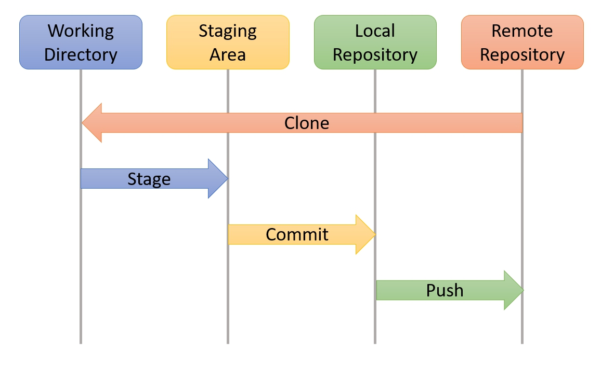

# DEVOPS-2 - 02 - Versiebeheer - Taak 09

## Samenvatting

- [DEVOPS-2 - 02 - Versiebeheer - Taak 09](#devops-2---02---versiebeheer---taak-09)
  - [Samenvatting](#samenvatting)
  - [Uitleg](#uitleg)
  - [Leerdoelen](#leerdoelen)
  - [Opdracht](#opdracht)
  - [Eindresultaat](#eindresultaat)
  - [Bronnen](#bronnen)

## Uitleg

Zo, we hebben veel concepten aangestipt in de vorige taken:
* **Git log (mbv Gitgrap of de terminal)**
  > Zodat je de geschiedenis kan inzien van een project

* **Stagen van bestanden voor een commit**
  > Zodat je bestanden die bij elkaar horen samen in een commit kan plaatsen (zodat je deze later weer kunt terughalen als je dat wilt)

* **Een commit uitchecken**
  > Zodat je een stapje terug kunt los van de undo in VS Code. In de praktijk zal je dit niet vaak gebruiken maar het kan soms handig zijn om te zien hoe je code er eerder uitzag voor je een x aantal commits later alles hebt veranderd.

* **Branches en branches uitchecken**
  > Zodat je zelfstandig aan een onderdeel van je project kunt werken zonder elkaar in de weg te zitten. 

* **Mergen van branches**
  > Zodat je daarna verder kan met dezelfde code waarin ieders werk is samengevoegd

* **Merge conflicten oplossen**
  > Zodat je code die conflicteerd met elkaar kunt samenvoegen en committen.

Als dit je allemaal nog niet helder is dan geeft dat niks. Git staat erom bekend dat het een tijdje duurt voor je begrijpt wat er op de achtergrond gebeurt. De enige manier om over die hobbel heen te komen is het te gebruiken en veel fouten te maken. En als je er echt niet uitkomt dan kun je altijd een nieuwe clone maken van het lesmateriaal en het opnieuw proberen.

De workflow die je gebruikte als je alleen aan het werk was in een repository zag er zo uit:

Inmiddels heb je geleerd hoe je commits of branches kan uitchecken (vanuit de local repository naar je Working Directory) en hoe je commits die een andere developer heeft gepushed naar een gedeelde remote repository kan ophalen met git pull. Zie onderstaand plaatje.

> :rocket: Uiteindelijk is straks de bedoeling dat je gaat samenwerken aan een challenge in een gedeelde repository. Dit kun je doen door een student waarmee je samenwerkt rechten te geven in de repository op Github. Dit doe je dus op https://www.github.com bij de settings van de repository en te kiezen voor `invite a collaborator`. Dit zal in de challenge verder worden uitgelegd.

## Leerdoelen

1. Ik weet kan het verschil uitleggen tussen de working directory, de staging area en de local en remote repository.
2. Ik weet wat er gebeurt als je de volgende git acties uitvoert: clone, stage, commit, push, checkout en pull.

## Opdracht

1. Lees bovenstaande samenvatting door en zorg dat je een beeld hebt bij de verschillende concepten die herhaald worden.

## Eindresultaat

## Bronnen
