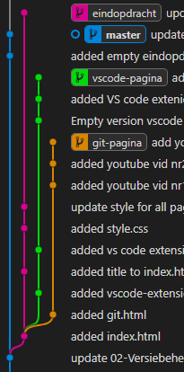
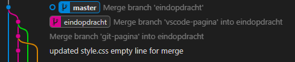
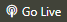
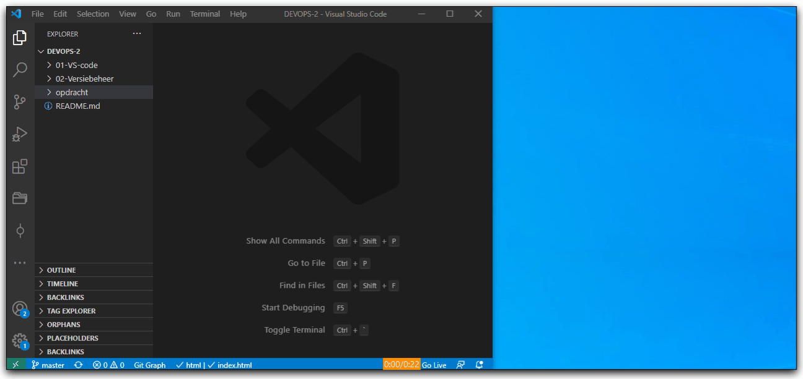

# DEVOPS - 2 - Eindopdracht

## Uitleg

In deze eindopdracht gaan we een aantal handelingen doen met Git en Github.

Er staat een simpele website in de opdracht/website map.

De repository ziet er ongeveer zo uit in Git Graph:

* De master branch zie helemaal links (in blauw).
* Er splits zich een branch vanaf genaamd eindopdracht (in roze)
* Daarvan splitsen zich weer twee branches: git-pagina (in oranje) en vscode-pagina (in groen)

Verschillende personen hebben werk uitgevoerd in de verschillende branches en dit gecommit. Uiteindelijk willen we alle branches gemerged hebben gemerged hebben in de master branch. Dit gaan we stap voor stap doen terwijl het resultaat in de gaten houden in een browser (via Live Server), in de Working Directory (de bestanden die je ziet in VS Code) en Git Graph.

Het eindresultaat ziet er zo uit in Git Graph:

## Opdracht

1. Checkout de eindopdracht branch in VS Code en open de website/index.html in VS Code.
2. Klik op de  rechts onder in het VS Code venster om een live versie van de website te openen in je standaard browser.
3. Zorg ervoor dat je je scherm inricht zoals aangegeven in onderstaande screenshot. 

## Eindresultaat

## Bronnen