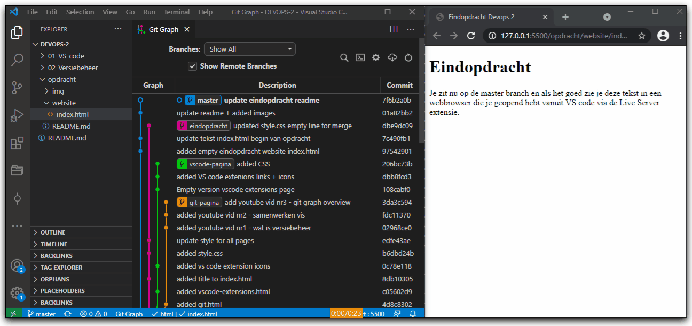
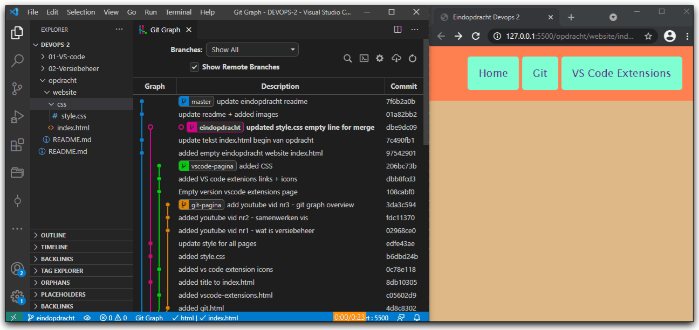
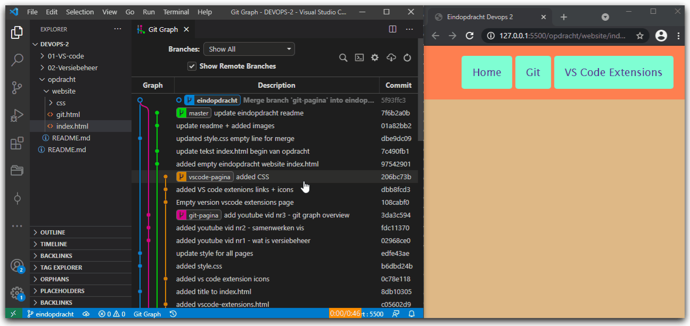
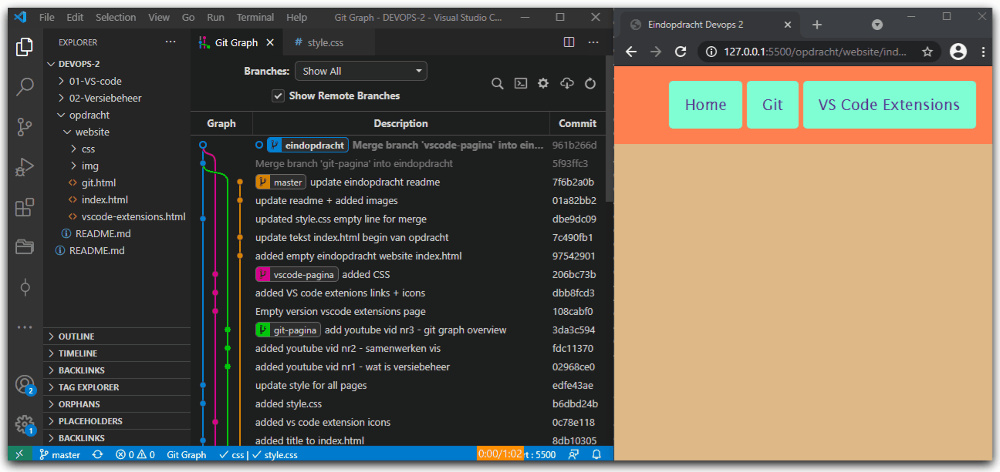

# DEVOPS - 2 - Eindopdracht

## Uitleg

In deze eindopdracht gaan we een aantal handelingen doen met Git en Github.

Er staat een simpele website in de opdracht/website map.

De repository ziet er ongeveer zo uit in Git Graph:

* De master branch zie helemaal links (in blauw).
* Er splits zich een branch vanaf genaamd eindopdracht (in roze)
* Daarvan splitsen zich weer twee branches: git-pagina (in oranje) en vscode-pagina (in groen)

Verschillende personen hebben werk uitgevoerd in de verschillende branches en dit gecommit. Uiteindelijk willen we alle branches gemerged hebben gemerged hebben in de master branch. Dit gaan we stap voor stap doen terwijl het resultaat in de gaten houden in een browser (via Live Server), in de Working Directory (de bestanden die je ziet in VS Code) en Git Graph.

Het eindresultaat ziet er zo uit in Git Graph:

## Opdracht

1. Setup
   1. Open de website/index.html in VS Code
   2. Klik op de  rechts onder in het VS Code venster om een live versie van de website te openen in je standaard browser.
   3. Open de Git Graph extensie in VS Code
   4. Zorg ervoor dat je je scherm inricht zodat je VS code ziet en het de website in een browser via Live Server. (als je het zonder Live Server wilt doen dan moet je handmatig na elke actie in VS de browser refreshen)
  
2. Checkout de eindopdracht branch
   1. Gebruik de Git Graph extensie. Zie onderstaand voorbeeld.
   
3. Merge de git-pagina branch
   1. Zorg ervoor dat het gelukt is om de eindopdracht branch uit te checken.
   2. Kies dan in de Git Graph interface via het rechtermuisknop menu op de **git-pagina** branch  `Merge into current branch`.
   3. De merge levert geen merge conflicts op en in je browser werkt nu de git pagina.
   
4. Merge vscode-pagina branch
   1. Je zit als het goed is nog steeds op de eindopdracht branch.
   2. Gebruik weer de Git Graph interface om de vscode-pagina branch te mergen.
   3. Dit keer treden er merge conflicts op. Open de Versiebeheer tab in VS code. Los de merge conflicts op door op style.css te klikken onder het kopje Merge Changes en kies uit welke code je wilt behouden. Sla style.css op en druk op het plusje om dit bestand toe te voegen aan de al gestagde bestanden zonder merge conflicts die onder het kopje Staged Changes staan. Maak een nieuwe commit (de commit message is weer zoals bij de vorige merge voor je ingevuld door VS Code.) 
   
5. Merge de eindopdracht branch met de master branch.
   1. Doe een checkout van de master branch
   2. Merge de eindopdracht branch in de master branch
   3. Los de merge conflicts op en stage en commit de veranderde bestanden.
   4. Check of de website helemaal werkt.
   

## Eindresultaat

## Bronnen